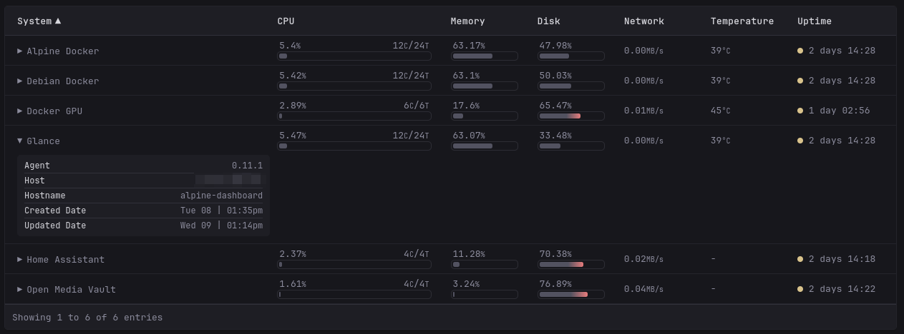

# Beszel System Table
---
> [!NOTE]
>
> Requires [Responsive Table](https://github.com/ralphocdol/glance-micro-scripts/blob/main/responsive-table/README.md).





## Custom CSS
`.with-progress-bar` class is required.

```css
.unit-suffix {
    font-size: 1rem;
    color: var(--color-text-base);
}

[responsive-table] .with-progress-bar {
    padding: 5px 20px 5px 3px; 
    line-height: normal;
}

@media (max-width: 768px) { 
    [responsive-table] .with-progress-bar {
        padding: unset;
    }
}
```