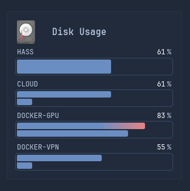
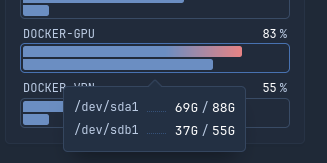
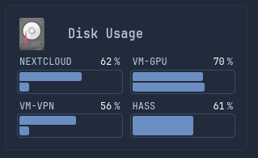

# Drive Stats
---

#### row=1



Hover:



This requires a web server which isn't provided.

However, the template can still be used. Expected API return is:
```json
[
    {
        "filesystem": "/dev/sda1",
        "size": "60GB",
        "used": "37GB",
        "avail": "23GB",
        "use_percent": 61,
        "mount": "sda1",
        "host": "hass.local",    // from hass.local:22 or just IP without port
    },
]
```

#### row=2
```yml
 url: https:${MY_WEBSERVER_URL}/api/get-drive-stats?host=host1&row=2
```
