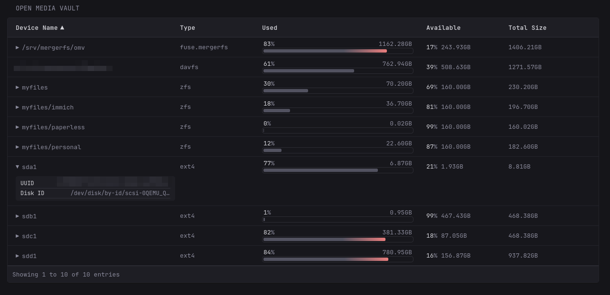
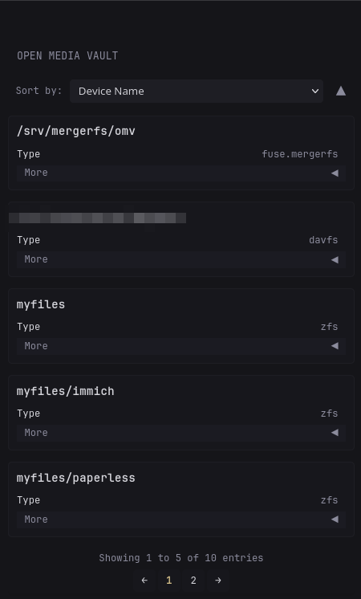

# OpenMediaVault Drives
---
> [!NOTE]
>
> Requires:
> - [Responsive Table](https://github.com/ralphocdol/glance-micro-scripts/blob/main/responsive-table/README.md)
> - [Custom Error Message](/defines/errorMsg.gohtml) (Optional)

> [!WARNING]
>
> Make the `cache` higher (30m) as this may be able ping the drives.

