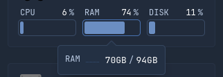

# Promox Widget Card
---




```
PROXMOXVE_URL=<ip>:8006
PROXMOXVE_KEY=<key>
DASHBOARD_ICONS=https://github.com/homarr-labs/dashboard-icons/raw/refs/heads/main
```

HTTPS issues ahead, see issue [#361](https://github.com/glanceapp/glance/issues/361).
