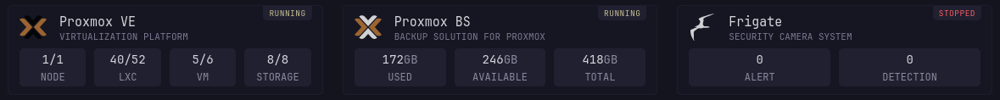
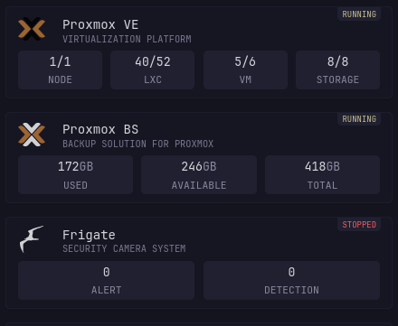
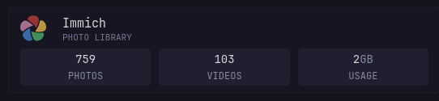

# Stats Cards
---
> [!NOTE]
>
> Requires [stat-grid-style.css](/styles/stat-grid-style.css)
>
> Compatibility with [Glimpse](https://github.com/ralphocdol/glance-micro-scripts/blob/main/glimpse/README.md)

## Shared Environment Variable
```ini
DASHBOARD_ICONS=https://raw.githubusercontent.com/homarr-labs/dashboard-icons/refs/heads/main
```
or your local repository mirror.

## Screenshots



with subtitle/description:



inspired by [Homepage](https://gethomepage.dev/)