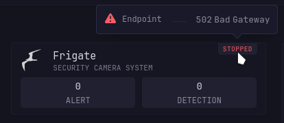

# Stats Cards
---
> [!NOTE]
>
> Dependency:
> - [stat-grid-style.css](/styles/stat-grid-style.css)
>
> Compatibility with:
> - [Glimpse](https://github.com/ralphocdol/glance-micro-scripts/blob/main/glimpse/README.md)
> - [Swipe Gesture](https://github.com/ralphocdol/glance-micro-scripts/blob/main/swipe-left-and-right/README.md)

## Screenshots


Status on hover:



## Shared Environment Variable
```ini
DASHBOARD_ICONS=https://raw.githubusercontent.com/homarr-labs/dashboard-icons/refs/heads/main
```
or your local repository mirror.

## Split Column type (Recommended)
```yml
pages:
  - name: Stats Cards
    columns:
      - size: full
        widgets:
          - type: split-column
            max-columns: 3
            widgets:
              $include: immich.yml
              $include: paperless-ngx.yml
```

## Side columns
If you prefer a the column sizes directly then you *may* want use the `stat-container-compact` to make it not look awkward
```yml
pages:
  - name: Stats Cards
    columns:
      - size: small
        widgets:
          $include: immich.yml
          $include: paperless-ngx.yml
      - size: full
        widgets:
          $include: other-widgets.yml
```
inside your `stats-cards` widget (eg: immich.yml), modify:
```go
{{ template "stat-container" }}
```


change to

```go
{{ template "stat-container-compact" }}
```


## Error Handling
Use the `custom-api`'s helper function `newRequest`.

---

inspired by [Homepage](https://gethomepage.dev/)
