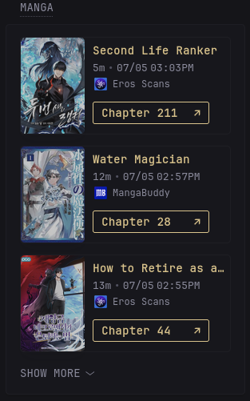

# Suwayomi Widget
---
> [!NOTE]
>
> Requires [vertical-release.css](/styles/vertical-release.css)

## With authentication
```yml
headers:
    Accept: application/json
    Authorization: Basic ${SUWAYOMI_AUTH} # base64 of username:password
```

