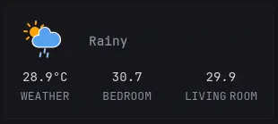

# Weather Widget Card
---
> [!NOTE]
>
> Requires Home Assistant, or not if you plan to use your own endpoint or modify this entirely

### Weather Data
Came from Open-Meteo using Home Assistant

#### Home Assistant endpoint

`https://<home-assistant-url>/api/states/<entity>`

### Weather Icons

Source: https://github.com/Makin-Things/weather-icons
