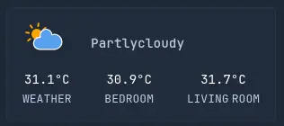

# Weather Widget Card
---


### Weather Data
Came from Open-Meteo using Home Assistant

#### Home Assistant endpoint

`https://<home-assistant-url>/api/states/<entity>`

### Weather Icons
Source: https://github.com/Makin-Things/weather-icons

Icons and state doesn't usually match so I had to do something on my middleware, it's not complete yet, but it is a start:
```js
// "date" based on "last_changed" from Home Assistant's API
const weatherIconMapping = (state, date) => {
    const hour = getHours(addHours(date, 8));
    const isDay = hour >= 6 && hour < 18; // 6am to 6pm
    const phase = isDay ? 'day' : 'night';
    if (state.includes('clear')) {
        return `clear-${phase}`
    } else if (state.includes('cloudy')) {
        return `cloudy-3-${phase}`;
    } else if (state.includes('rainy')) {
        return `rainy-3-${phase}`;
    } else if (state.includes('fog')) {
        return `fog-${phase}`;
    } else if (state.includes('isolated-thunderstorms')) {
        return `isolated-thunderstorms-${phase}`;
    } else if (state.includes('scattered-thunderstorms')) {
        return `scattered-thunderstorms-${phase}`;
    } else if (state.includes('lightning')) {
        return `thunderstorms`;
    } else if (state.includes('sunny')) {
        return `clear-day`;
    }

    return state;
}
```

### Sample API output
```json
[
  {
    "entity_id": "weather.weather_home",
    "state": "partlycloudy",
    "unit_of_measurement": null,
    "friendly_name": "Weather Home",
    "weatherIcon": "cloudy-3-day",
    "moreData": {
      "temperature": 31.1,
      "temperature_unit": "°C",
      "pressure_unit": "hPa",
      "wind_speed": 2.7,
      "wind_speed_unit": "km/h",
      "visibility_unit": "km",
      "precipitation_unit": "mm",
      "attribution": "Powered by Home Assistant",
      "friendly_name": "Weather Home",
      "supported_features": 0
    }
  },
  {
    "entity_id": "sensor.room_temperature",
    "state": "30.9",
    "unit_of_measurement": "°C",
    "friendly_name": "Room Temperature",
    "weatherIcon": "",
    "moreData": {}
  },
  {
    "entity_id": "sensor.living_room_temperature",
    "state": "31.7",
    "unit_of_measurement": "°C",
    "friendly_name": "Living Room Temperature",
    "weatherIcon": "",
    "moreData": {}
  }
]
```

