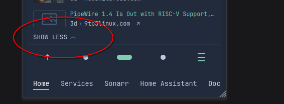

# This adds a helper script for Glance
Script tested for [Glance v0.7.3](https://github.com/glanceapp/glance/releases/tag/v0.7.3)
## document.yml
This file has the script loader for custom.js, it loads it using `file modified` date as [Cache Busting](https://www.keycdn.com/support/what-is-cache-busting) assuming your reverse proxy server supports it. Otherwise, you can simply do:
```js
<script src="/assets/custom.js?v=1"></script>
```
updating to `v=2` and so on, or use `timestamp` which is probably isn't a good idea.

## glance.yml
```yml
document:
  !include: document.yml

server:
  assets-path: /app/assets
```

---

## custom-api's \<scripts\>
Using `customApiScriptLoader.js`
> ### <span style="color:red;">WARNING!</span>
> Using API queries with API keys within the script is possible but it **WILL** expose them.

Adding `<script></script>` in the custom API template does not work, as the script will not load. Additionally, there is currently no way to automatically refresh widgets independently.

The template should have the class `custom-api-scripts` and the function `scriptLoad()`
```html
<script class="custom-api-scripts">
  const scriptLoad = () => {
    // your scripts here
  }
</script>
```

*Separating them just to make things readable*
```yml
- type: custom-api
  url: https://domain.com/api
  headers:
    Accept: application/json
  template: |
```
```html
    <script class="custom-api-scripts">
      const scriptLoad = () => {
        const updateClock = () => {
          const now = new Date();
          document.getElementById('clock').textContent = now.toLocaleTimeString();
        };

        updateClock();
        setInterval(updateClock, 1000);
      }
    </script>
    <div id="clock"></div>
```
##### With query
```yml
- type: custom-api
  cache: 6h
  css-class: custom-widget-test
  template: |
```
```html
    <script class="custom-api-scripts">
      const scriptLoad = () => {
        setInterval(async () => {
          const mainElement = document.querySelector('.custom-widget-test');
          if (mainElement && mainElement.length === 0) return;
          try {
            const response = await fetch('https://uselessfacts.jsph.pl/api/v2/facts/random');
            const data = await response.json();
            mainElement.querySelector('.custom-text').innerText = data.text;
          } catch (error) {
            console.error({ from: 'custom-widget-test.yml', error });
          }
        }, 300000); // every 5mins, change depending on the API's rate limit
      }
    </script>
    <div class="custom-widget-test">
      <p class="size-h4 color-paragraph custom-text">{{ .JSON.String "text" }}</p>
    </div>
```

---

## Mobile navigation workaround
Workaround when using
```yml
expand-mobile-page-navigation: true
```

By default, the `SHOW LESS` will be behind the navigation bar, this addresses that issue.



---

## Adding a module
1. Create a `.js` inside the modules folder
  
  *Example: testModule.js*
```js
export default () => {
  console.log('This is an example.')
}
export const anotherTest = () => {
  console.log('Another one.');
}
```
2. Add the file name inside `modules.json`
```json
{
    "modules": [
      //... other modules,
      "testModule.js"
    ]
  }
```
3. Use it in `custom.js` as
```js
const loadScript = async (timestamp) => {
  //...omitted
  allModules.testModule.default(); // This is an example.
  allModules.testModule.anotherTest(); // Another one.
};
```